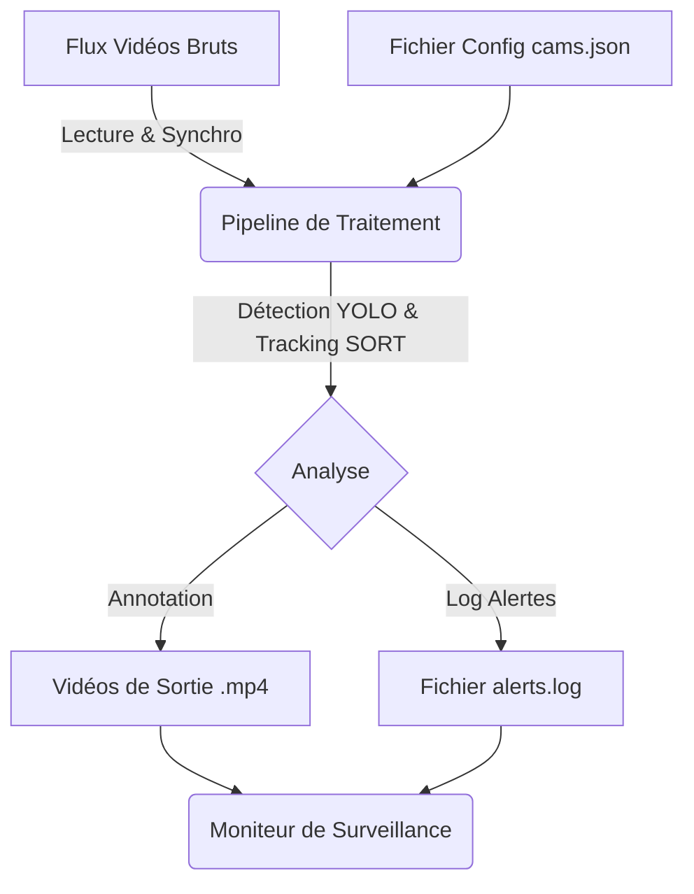

 # Architecture du Système de Surveillance

Ce document détaille la structure technique, le rôle des composants et l'orchestration du flux de données au sein du projet de surveillance vidéo intelligent.

## 1. Vue d'Ensemble

Le système est conçu comme un **Pipeline de Traitement Vidéo Asynchrone**. Il sépare nettement la phase de **traitement lourd** (analyse, détection, tracking) de la phase de **visualisation** (moniteur fluide).

### Flux de Données


---

## 2. Structure du Projet

Voici l'organisation des fichiers et leur responsabilité :

```
.
├── cams.json           # Cerveau du système : Configuration centralisée
├── pipeline.py         # Cœur du système : Moteur de traitement ETL
├── monitor.py          # Interface Homme-Machine (IHM) : Visualisation
├── zone_selector.py    # Outil utilitaire : Configuration graphique
├── sort.py             # Algorithme : Logique de suivi (Tracking)
├── output/             # Stockage : Résultat du traitement
└── videos-camera/      # Données : Sources vidéo brutes
```

---

## 3. Détail des Composants

### 3.1. Le Cerveau : `cams.json`
C'est la source de vérité unique. Il contient pour chaque caméra :
*   **Source** : Chemin du fichier vidéo.
*   **Méta-données** : `start_time` (Heure absolue de début, crucial pour la synchronisation) et `rotate` (correction d'orientation).
*   **Géométrie** : `zones` (Polygones définissant les zones d'alerte, entrées, sorties).

### 3.2. Le Moteur : `pipeline.py`
Ce script orchestre tout le traitement. Il fonctionne séquentiellement en "Batch" pour maximiser l'efficacité du CPU.

**Les étapes du Pipeline :**
1.  **Ingestion & Normalisation** :
    *   Lit les vidéos hétérogènes (résolutions et durées différentes).
    *   Applique les rotations (90°, -90°) et effets miroirs (`flip`).
    *   **Synchronisation Temporelle** : Calcule une fenêtre temporelle globale. Pour les caméras qui commencent plus tard que les autres, le pipeline génère des **frames noires (padding)** au début. Cela garantit que toutes les vidéos de sortie commencent exactement au même instant $T_0$.
2.  **Détection (YOLOv8)** :
    *   Utilise le modèle `yolov8n` (Nano) optimisé pour CPU.
    *   **Double Seuil de Sensibilité** :
        *   *Haute Confiance (0.40)* pour les **Humains** (éviter les faux positifs).
        *   *Haute Sensibilité (0.15)* pour les **Objets** (Sacs, téléphones) qui sont plus difficiles à voir.
3.  **Suivi (Tracking - `sort.py`)** :
    *   Associe les détections d'une image à l'autre pour maintenir une **Identité (ID)** unique.
    *   Gère la disparition temporaire (occlusion) pour éviter que les boîtes ne clignotent (Ghost Fix).
4.  **Logique Métier** :
    *   Vérifie si le centre de l'objet se trouve dans une `zone_alerte`.
    *   Si oui : Dessine un cadre rouge et inscrit l'événement dans `alerts.log` avec l'horodatage réel.
5.  **Rendu** :
    *   Dessine les boîtes, les IDs, et les traînées (trails) colorées.
    *   Encode la vidéo annotée à **10 FPS** dans le dossier `output/`.

### 3.3. L'Algorithme de Suivi : `sort.py`
Implémente une version simplifiée de l'algorithme SORT (Simple Online and Realtime Tracking).
*   **IOU (Intersection Over Union)** : Mesure le chevauchement entre la boîte de l'image précédente et la nouvelle détection.
*   **Algorithme Hongrois** : Résout le problème d'assignation pour marier les anciennes pistes aux nouvelles détections de manière optimale.

### 3.4. L'Outil de Configuration : `zone_selector.py`
Un script interactif utilisant OpenCV.
*   Charge la première image de chaque caméra.
*   Permet à l'utilisateur de cliquer pour dessiner des zones.
*   Sauvegarde automatiquement les coordonnées normalisées dans `cams.json`.

### 3.5. L'Interface : `monitor.py`
Le lecteur vidéo final destiné à l'opérateur de sécurité.
*   **Indépendance** : Ne fait aucun calcul lourd. Il se contente de lire les fichiers préparés par le pipeline.
*   **Grille Haute Résolution** :
    *   Contrairement aux systèmes classiques qui redimensionnent les flux en basse qualité, ce moniteur crée une grille virtuelle de résolution native (cellules de 1280x1280 px).
    *   Centre les vidéos portrait et paysage avec des marges intelligentes.
*   **Contrôles de Lecture** :
    *   Lecture synchronisée (boucle sur toutes les vidéos frame par frame).
    *   Vitesse calibrée sur le FPS du pipeline (100ms pour 10 FPS).
    *   Saut temporel (Seek) de 5 secondes pour une navigation rapide.

---

## 4. Orchestration et Flux de Travail

1.  **Préparation** : L'utilisateur définit les zones via `zone_selector.py`.
2.  **Traitement (Batch)** : L'utilisateur lance `pipeline.py`.
    *   Le système "mouline" en tâche de fond. C'est l'étape la plus longue.
    *   Il transforme des données brutes, désynchronisées et muettes en données structurées, synchronisées et annotées.
3.  **Exploitation** : L'opérateur lance `monitor.py`.
    *   Il accède instantanément à une vue unifiée.
    *   Grâce à la phase de synchronisation (padding) du pipeline, l'opérateur voit les événements se dérouler simultanément sur toutes les caméras sans décalage temporel.

## 5. Choix Techniques Clés (MVP)
*   **Pourquoi 10 FPS ?** : Compromis idéal entre fluidité visuelle pour l'humain et charge CPU. 30 FPS serait 3x plus lent à traiter sans gain majeur pour de la surveillance.
*   **Pourquoi le Padding (Cadres Noirs) ?** : Simplifie drastiquement le code du Moniteur. Le moniteur n'a pas besoin de gérer des horloges complexes, il suffit de lire la frame $N$ de chaque fichier simultanément.
*   **Pourquoi CPU ?** : Utilisation de modèles "Nano" et d'algorithmes géométriques légers pour fonctionner sans carte graphique dédiée (GPU).
